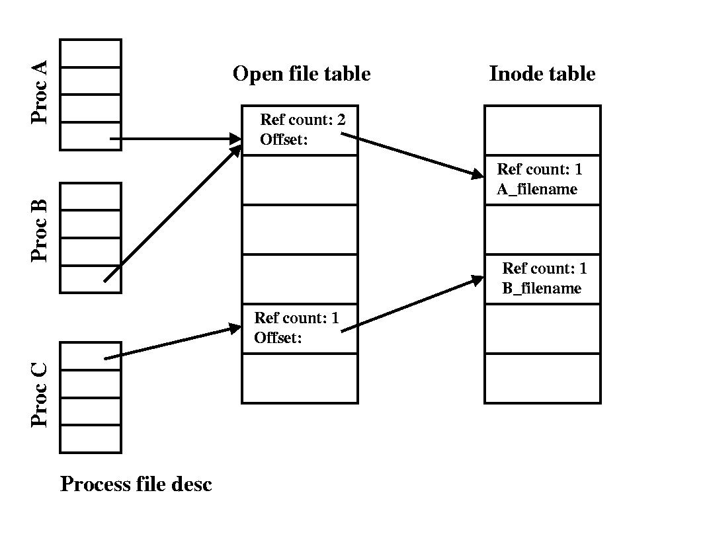

# Question
split2.bash

# fd data structure
fd picture


`3>&1` means `fd[3] = fd[1]`

# switch stdout and stderr
```bash
bash switch.sh > /dev/null
bash switch.sh 2> /dev/null
```
# difference

```bash
./myprint.pl  2>&1 >log.txt
./myprint.pl  >log.txt 2>&1
```
# answer
split.sh